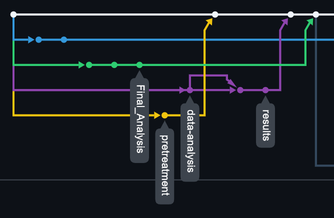

# GitHub: Crear un repositorio y control de versiones

## Asignatura: Introducción a la programación científica

### Integrantes del Grupo
- Ana Padilla Campos — [@anapac00](https://github.com/anapac00) — ana.padilla977@comunidadunir.net 
- Antonio Jesús Gil Galisteo — [@Antoniogilgalis](https://github.com/Antoniogilgalis) — antoniojesus.gil895@comunidadunir.net
- Beatriz Esquivel Carrera — [@BeaEsca](https://github.com/BeaEsca) — beatriz.esquivel228@comunidadunir.net
- Eva García Valero — [@egarciaval](https://github.com/egarciaval) — eva.garcia46@comunidadunir.net 
- Beatriz López Martínez — [@BeatrizLM](https://github.com/BeatrizLM) — beatriz.lopez269@comunidadunir.net


## Índice
- [Descripción](#descripcion)
- [Flujo de trabajo para la actividad](#flujo-de-trabajo-para-la-actividad)

---

## Descripción

### Propósito y estructura

El proyecto **Genome Sequence Analysis** tiene como objetivo comparar los resultados de una secuenciación con diferentes secuencias modelo. Para ello, se ha estructurado según los diferentes pasos en los que se divide un análisis genético:

- En primer lugar, se han obtenido los genomas crudos tras la secuenciación. Dichas secuencias se encuentran almacenadas en la carpeta *sequences*.
- A continuación, tras limpiar las secuencias obtenidas, se ha realizado un análisis comparativo entre ellas, cuyo proceso se encuentra en *validation methods*.
- Tras la comparación, se ha obtenido una secuencia final, ubicada en *data-results*.
- Finalmente, por medio de diferentes herramientas de comparación genética, se ha realizado el alineamiento de la secuencia para conocer la similitud con otros organismos. Los resultados de este análisis se han recogido en la carpeta *comparative-analysis*.

### Objetivos

Teniendo en cuenta el apartado anterior, se pueden diferenciar múltiples objetivos:

1. Creación de un repositorio **GitHub** para facilitar el trabajo del grupo.
2. Manipulación de secuencias genéticas.
3. Uso de herramientas bioinformáticas que permiten tanto el procesado como el alineamiento y la comparación de las secuencias.
4. Interpretación de los resultados obtenidos tras la comparación. 
5. Elaboración de una memoria que refleje todo el proceso.

### Instrucciones de uso
A continuación se describen los pasos necesarios para ejecutar y reproducir el flujo de análisis del proyecto **Genome Sequence Analysis**. Aunque el repositorio está organizado en carpetas según las fases del análisis, estas instrucciones indican cómo utilizar el proyecto como si fuera una pequeña herramienta bioinformática modular.

1. Para clonar el proyecto en local, ejecutar el siguiente comando en la consola de su máquina local:
```bash
git clone https://github.com/BeatrizLM/UNIR-Group1-GenomeSequenceAnalysis.git
```
2. Acceder a la carpeta del proyecto:
```bash
cd UNIR-Group1-GenomeSequenceAnalysis
```

3. Coloca tus archivos .fasta en la carpeta:
```bash
/sequences/
```

3. (Si existieran scripts) ejecutar:
```bash
python validation-methods/script.py sequences/mi_secuencia.fasta
```
Resultados en:
```bash
/validation-methods/results/
```

4. Guardar la secuencia validada en:
```bash
/data-results/
```

5. Utilizar ORFfinder, BLAST, COBALT y PROSITE.
Guardar resultados en:
```bash
/comparative-analysis/
```

6. Para añadir nuevos análisis
```bash
git checkout -b nueva_rama
git add .
git commit -m "Nuevo análisis"
git push origin nueva_rama
```
Crear pull request hacia main.


**NOTA**. Estas instrucciones son un ejemplo y no representan un flujo real.

## Flujo de trabajo para la actividad

El trabajo se ha dividido en dos fases: la construcción del proyecto base y la documentación colaborativa del fichero README.md.

### Primera Fase

En la primera fase, cuatro integrantes han creado una rama correspondiente a cada etapa del proyecto, mientras que el quinto miembro ha gestionado el repositorio y administrado los pull requests. Para simular un entorno de trabajo real, se ha utilizado **Visual Studio Code**, tanto para la manipulación del proyecto como para la ejecución de git desde la terminal y la interfaz gráfica.

En esta fase se han probado distintos escenarios:

1. Trabajo independiente en una rama y subida directa a la rama principal. Esto se ha hecho en las ramas *pretreatment* y *Final_Analysis*.
2. Trabajo en una rama con pull request sobre otra rama y posterior subida a la principal (*data-analysis* y *results*).

El siguiente gráfico muestra el flujo de Git seguido en esta fase: 



### Segunda Fase

Como se ha comentado, la segunda fase ha consistido en la coordinación de redacción del archivo *README.md*. Esta fase ha implicado:

1. Creación de la rama *readme_changes* a partir de *main*.
2. Creación de subramas individuales para que cada integrante documentara su parte del trabajo.
3. Fusión de todas las subramas en *readme_changes* para generar un documento final completo.
4. Al proceder esta rama de forma paralela al resto, debe hacerse mediante un checkout a main y una posterior fusión.

En esta fase surgieron diversos conflictos de fusión, que se resolvieron mediante herramientas como git *reset --hard*. Estos incidentes han sido útiles para comprender situaciones frecuentes en el uso real de Git.

### Actualizaciones posteriores

Tras completar ambas fases, se creó la rama **RNA_sample_03_Nov_2025_V2** a partir de readme_changes, con el objetivo de analizar nuevas secuencias.
Se añadieron archivos a la carpeta *sequences* y se actualizaron las carpetas *validation-methods* y *data-results*, simulando un segundo análisis dentro del proyecto. Además, se actualizó el fichero .gitignore para evitar la subida de *.vscode* y se hicieron retoques finales en el archivo README.md.
